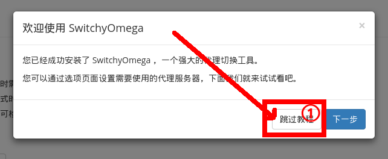
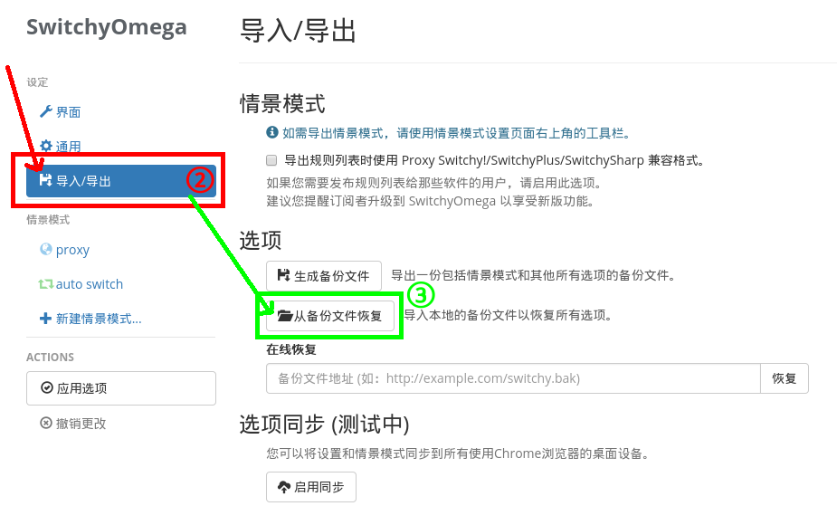
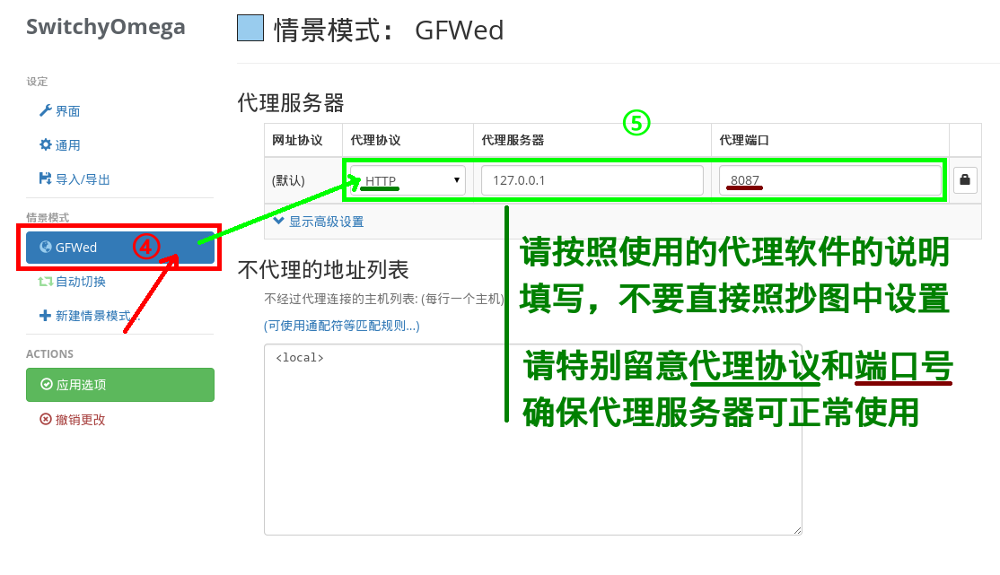
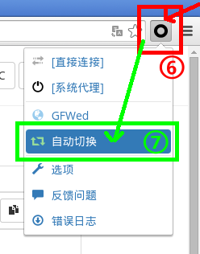
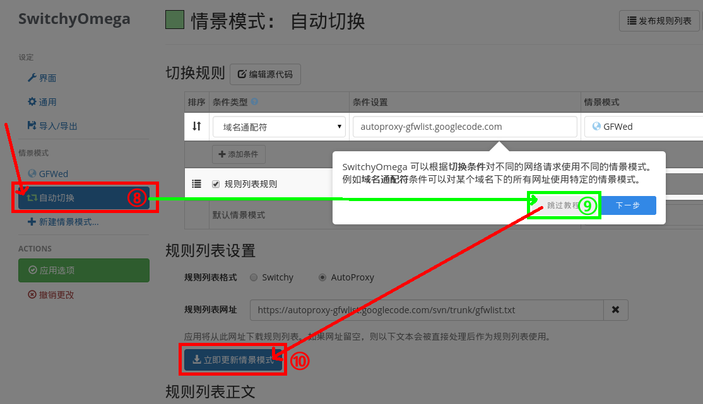
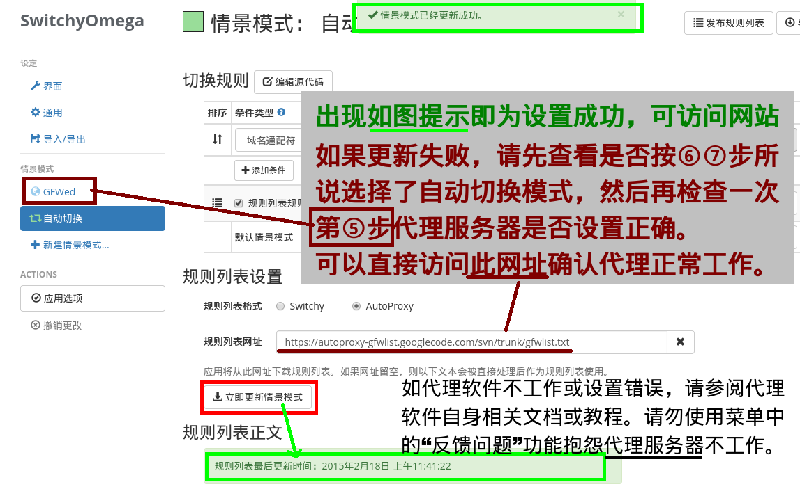

以下步骤用于 SwitchyOmega 配合 [GFWList 项目](https://github.com/gfwlist/gfwlist)使用的场合。中国大陆地区用户建议按照以下说明进行配置。

安装 SwitchyOmega
-----------------

首先你需要安装 SwitchyOmega。SwitchyOmega可以[在谷歌应用商店安装](https://chrome.google.com/webstore/detail/proxy-switchyomega/padekgcemlokbadohgkifijomclgjgif/?hl=en)。
  * 如果因为网络问题安装失败，您也可以直接[在 Github 上下载最新版安装包](https://github.com/FelisCatus/SwitchyOmega/releases)，然后按照下载页面上的说明手动安装。

安装完毕后应该会自动打开选项页面，之后按以下说明操作即可。

导入备份
-------

这里有一段介绍性的教程。如果想了解SwitchyOmega的不妨跟着教程走一遍。如果急着设置好的话，还是点跳过吧 :smile: 。（阅览教程与否不影响接下来的步骤。）

按照下图，在导入导出页面点击“从备份文件恢复”。那么问题就来了，已经配置好的设置备份文件哪家强？SwitchyOmega项目组找FelisCatus！[我这里有提供备份文件，大家可以自己下载使用](./GFWList.bak)。假如打开来是个网页怎么办？右键另存为呗。此外如果曾经在SwitchySharp里配置过了，直接用SwitchySharp导出的备份文件也行的，不过要记得按照此页面最下方的说明，更改一下规则列表的网址。

图中第三步会打开一个选择文件的对话框，这时候选择刚下载好的备份文件就行了。

设置代理服务器
-------------

这部分比较简单，在“GFWed”情景模式设置好代理协议和端口就好了。再一次说明，请仔细阅读您所使用的代理软件说明书，尤其是不要填错了代理协议（常见的有HTTP或SOCKS），因为那个填错了有一大堆问题，程序还不会提示你填错了。

虽然我已经说过很多次了， **但如果你还没有代理服务器，那你要 SwitchyOmega 干嘛呢？** 你需要去弄一个代理服务器/代理软件，然后先把代理运行起来再说。什么？哪里有免费的代理服务器？这和我又有什么关系呢？ SwitchyOmega 的作用只是告诉 Chrome 应该使用什么代理，配置哪些网址用哪些代理而已。 SwitchyOmega 不是翻墙软件，也没有义务提供免费的代理服务器或是帮你翻墙。

更新规则列表
-----------

GFWList 项目是一个经常更新的项目，提供的规则列表也是需要定期下载更新的。还好 SwitchyOmega 项目有提供自动下载功能，可以应对变化迅速的网络环境。不过，既然马上就要用来上网，那自然是要 **手动进行首次下载的** ，对不对？

**记得先在菜单里选自动切换模式。** 用直接连接或系统模式有可能会下载失败。为什么呢？因为规则列表网址本身也有可能需要代理才能访问。

这还有什么好说的，在自动切换设置底部点击那个蓝色的“立即更新情景模式”按钮就是了。完全照着图片上的步骤点过去就是了，不需要多费功夫。当然有人会注意到自动切换又弹出一段教程。为什么呢？因为自动切换算是一个比较复杂的概念，今后的手动配置也需要用到自动切换。再一次的，这里是可以跳过教程的。想看看教程我也不反对，加深理解嘛。只是之后别忘记点那个“立即更新情景模式”按钮就好。

如果成功了，大概会像是图中这样：

（注： GFWList 规则列表网址已经变更，见此页面最下方说明。截图中仍然是旧网址，但除此之外操作步骤相同，并没有其他错误。）

但如果显示更新失败呢？图上很多字，我也不复述了。但我还是要再罗嗦一句， **大部分出现“更新失败”提示的用户，都是因为代理服务器设置不正确。少部分呢？是因为其实没有代理服务器** ，只是盲目按照上面的图片走了个没有意义的流程。

但你不访问网页试试看，怎么知道代理服务器不工作呢？所以，试着访问一个配置成需要使用代理服务器才能访问的网址吧。一个很好的例子就是规则列表本身的网址[（可以直接点这里）](https://raw.githubusercontent.com/gfwlist/gfwlist/master/gfwlist.txt)。或者，也可以在图标的弹出菜单里切换到 GFWed （这样所有网址都会使用代理，相当于全局模式），然后再打开新标签页访问任意网站。

设置成功后，访问网页中如果有资源（如样式、图片、脚本等）未加载成功，则图标上会有提示。点菜单里未加载的资源即可，按提示操作，选择 GFWed ，让那些资源走代理一般就可以了。有时候这样操作一次还不够，因为新加载成功的资源又加载了别的资源，那重复个两三次大概也就行了。

P.S. 资源加载失败可能是多种原因导致，除了没有使用代理服务器以外，也可能是网络本身或者代理服务器不稳定、太慢，或者干脆是对方服务器的问题之类的。 SwitchyOmega 作为一个设置软件，很难判断具体是什么原因，只能向您报告问题而已。有时候即使用了代理也打不开，那也不是 SwitchyOmega 坏掉了。如果看见图标上有个数字觉得很烦很焦躁，可以到选项>通用>网络请求里关闭检测功能，但这只能隐藏问题而不能真正解决问题。

gfwlist 规则列表地址更新
----------------------

GFWList 项目现在已经[迁移到 Github](https://github.com/gfwlist/gfwlist)。因此， GFWList 规则列表的发布地址也发生了变化。

[这里提供的备份文件](./GFWList.bak)已经使用了新的地址，新用户请放心使用。老用户也可下载新版备份文件覆盖（注意：会清空自定义的设置）。  **如果想继续使用现在的设置，请注意在自动切换中，将规则列表网址手动改为新地址！** SwitchyOmega 不知道您在用 GFWList ，也不会自动更改列表的 URL 地址，所以只能请您手动改一下了。具体的要修改的位置在上面一张图上有标识，是深红色下划线标出的那个文本框（截图中仍然是旧地址，新地址见下方）。

新地址：  `https://raw.githubusercontent.com/gfwlist/gfwlist/master/gfwlist.txt`

旧地址： ~~`https://autoproxy-gfwlist.googlecode.com/svn/trunk/gfwlist.txt`~~ （请不要再使用这个地址了，已经很久不更新了。）